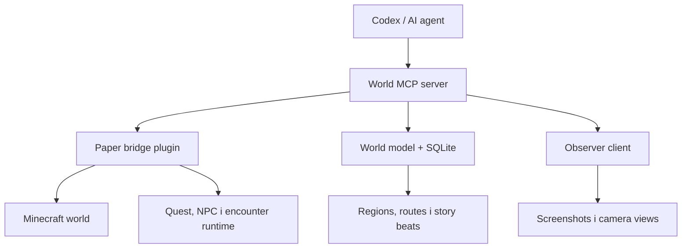
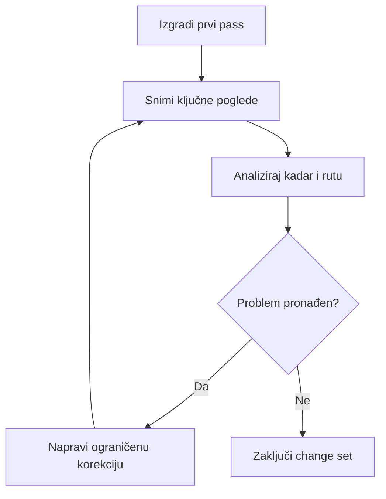

Minecraft World Agent — glavni izvedbeni plan

Vlasnik projekta: Ivan Delić
Status: Plan za početak razvoja
Primarni cilj: napraviti sustav kojim Codex može planirati, graditi, pregledavati, testirati i iterativno popravljati custom Minecraft adventure mape.

────────

1. Vizija proizvoda

Minecraft World Agent nije samo generator komandi ili plugin. To je razvojno okruženje u kojem AI razumije mapu kao skup smislenih lokacija, gameplay pravila i story beatova, a zatim koristi sigurne alate za izravne promjene svijeta.

Krajnje korisničko iskustvo treba izgledati ovako:

> “Napravi Act 2 između napuštenog sela i rudnika. Dodaj oko osam minuta gameplaya, jedan environmental puzzle, zasjedu i opcionalni lore prostor. Nakon gradnje pregledaj ključne kadrove, provjeri može li igrač preskočiti quest i popravi probleme.”

Agent zatim:

1. učita postojeći story, map graph i stanje svijeta;
2. napravi layout i plan promjena;
3. izgradi geometriju i dekoraciju;
4. postavi NPC-e, questove, encountere i triggere;
5. snimi ključne poglede;
6. analizira vidljivost, navigaciju i atmosferu;
7. pokrene automatizirane provjere;
8. popravi pronađene probleme;
9. isporuči pregled promjena i način testiranja.

2. Početne odluke

|Područje           |Odluka za prvu verziju                                  |Razlog                                                                   |
|-------------------|--------------------------------------------------------|-------------------------------------------------------------------------|
|Izdanje igre       |Minecraft Java Edition                                  |Najbolji ekosustav za Paper, WorldEdit, resource packove i custom tooling|
|Server             |Paper, verzija prikovana po projektu                    |Stabilan API i dobra kontrola gameplaya                                  |
|Gameplay kod       |Custom Paper plugin u Javi, Gradle build                |Predvidljiv deploy, široka kompatibilnost i jednostavnije debugiranje    |
|Gradnja svijeta    |WorldEdit/FAWE adapter + vlastite građevne primitive    |Brze bulk promjene i undo bez milijuna pojedinačnih poziva               |
|MCP sloj           |TypeScript/Node MCP server                              |Jednostavno definiranje validiranih AI alata i lokalne orkestracije      |
|World model        |YAML/JSON dokumenti + SQLite indeks                     |Ljudski čitljivi izvori uz brzo prostorno pretraživanje                  |
|NPC sustav         |Vlastiti gameplay model s adapterom za prikaz NPC-a     |Quest logika ne smije ovisiti o jednom vanjskom NPC pluginu              |
|Screenshotovi      |Companion observer klijent/mod                          |Omogućuje stvarni pogled iz Minecraft renderera, ne samo čitanje blokova |
|Verzije mape       |Git za kod i dokumente; snapshot/export za world podatke|Siguran povratak na ranije stanje                                        |
|Prvi vertical slice|15–20 min horror mapa: napušteno rudarsko selo          |U jednom testu pokriva atmosferu, NPC-e, puzzle, combat i cutscene       |

Točne verzije Paper/WorldEdit/Fabric ovisit će o verziji Minecrafta odabranoj na kickoffu. Sve se verzije zaključavaju u projektu; automatske nadogradnje nisu dio MVP-a.

3. Granice projekta

MVP mora moći

• pokrenuti lokalni development server jednim postupkom;
• čitati blokove, entitete i označene regije;
• raditi sigurne promjene unutar dopuštenog build područja;
• graditi iz primitiva kao što su soba, zid, luk, put, kuća, ruševina i tunel;
• spremiti strukture kao ponovno iskoristive module;
• voditi semantički model lokacija i njihovih veza;
• postaviti NPC, dijalog, quest, trigger, checkpoint i encounter;
• napraviti undo ili vratiti snapshot;
• teleportirati observer kameru na spremljene kadrove i snimiti screenshot;
• pokrenuti osnovne validacije rute, triggera i progression statea;
• proizvesti jasan change report nakon svake veće radnje.

Nije dio prvog MVP-a

• generiranje cijelih AAA mapa iz jedne rečenice;
• kvalitetan organski terrain bez ikakvog ljudskog art passa;
• automatsko stvaranje svih custom tekstura, modela, voiceova i glazbe;
• potpuno autonomno testiranje svakog mogućeg ponašanja pravog igrača;
• podrška za više nepovezanih verzija Minecrafta istodobno;
• javni cloud servis i multi-user suradnja;
• marketplace za gotove mape ili module.

4. Arhitektura



4.1 World MCP server

Središnji kontrolni sloj. Prima strukturirane pozive od agenta, validira parametre, provjerava granice i šalje operacije prema Minecraft serveru ili observer klijentu.

Odgovornosti:

• schema validacija svakog alata;
• build-area i permission provjere;
• grupiranje operacija u transakcije;
• audit log svih izmjena;
• snapshot prije rizične promjene;
• timeout, retry i čitljive poruke greške;
• dohvat semantičkog konteksta umjesto slanja cijelog svijeta agentu.

4.2 Paper bridge plugin

Plugin izvršava dopuštene operacije u svijetu i izlaže kontrolirani lokalni API MCP serveru.

Moduli:

• world inspection;
• block/region mutation;
• WorldEdit/FAWE adapter;
• region i trigger registry;
• NPC i dialogue runtime;
• quest state machine;
• cutscene sequencer;
• encounter/boss runtime;
• checkpoint/save state;
• telemetry i test hooks.

4.3 Semantički world model

Agent ne bi trebao pamtiti mapu kao gole koordinate. Svaka važna lokacija dobiva identitet, granice, ulogu i veze.

```yaml
location:
  id: mining_village.square
  type: hub
  bounds: { min: [110, 62, -80], max: [165, 90, -25] }
  entrances:
    - village.gate
    - mine.road
  landmarks:
    - church_tower
    - dry_well
  story_beats:
    - discover_missing_miners
  gameplay_tags:
    - safe_intro
    - investigation
```

World model vodi:

• regije i podregije;
• građevine i njihove dijelove;
• glavne i opcionalne rute;
• ulaze, izlaze i chokepointe;
• sightline/camera točke;
• NPC-e, questove i triggere;
• story beatove;
• encounter zone;
• zabranjena i zaštićena područja;
• ovisnosti između sadržaja.

4.4 Observer klijent

Za pravi vision loop potreban je Minecraft klijent koji može:

• ući na lokalni server kao spectator;
• teleportirati se na spremljenu camera točku;
• namjestiti yaw, pitch, FOV, vrijeme i vrijeme dana;
• sakriti HUD;
• snimiti screenshot u poznatu mapu;
• vratiti putanju i metadata MCP serveru.

MVP može prvo koristiti poluautomatski observer, a zatim companion Fabric mod za potpuno upravljanje kamerom.

5. Hijerarhija alata

Agent prvenstveno koristi alate višeg nivoa. Niskorazinske operacije ostaju dostupne za inspekciju i precizne popravke.

|Nivo            |Primjeri                                                              |Namjena                          |
|----------------|----------------------------------------------------------------------|---------------------------------|
|L1 — blokovi    |`get_blocks`, `set_block`, `fill_region`, `replace_palette`           |Precizne korekcije i debug       |
|L2 — arhitektura|`build_wall`, `build_arch`, `build_roof`, `build_stairs`, `build_path`|Sastavljanje dijelova građevine  |
|L3 — moduli     |`place_house`, `place_ruin`, `place_bridge`, `place_cave_room`        |Brza gradnja smislenih struktura |
|L4 — gameplay   |`create_quest`, `spawn_npc`, `create_encounter`, `create_checkpoint`  |Adventure logika                 |
|L5 — namjera    |`build_district`, `decorate_area`, `extend_gameplay_segment`          |Ciljevi koje agent razlaže u plan|

Minimalni MCP toolset

Inspekcija

• world.get_summary(region_id)
• world.get_blocks(bounds, sampling_mode)
• world.get_entities(bounds)
• world.inspect_area(region_id, checks[])
• world.get_heightmap(bounds)
• world.get_light_report(bounds)
• world.get_change_history(scope)

Gradnja

• build.begin_transaction(name, bounds)
• build.fill_region(bounds, block_palette)
• build.replace_palette(bounds, replacements)
• build.place_structure(structure_id, origin, rotation, mirror)
• build.create_path(from, to, width, style)
• build.create_room(spec)
• build.decorate_area(region_id, theme, density, seed)
• build.damage_pass(region_id, age, severity, seed)
• build.commit_transaction(id)
• build.rollback_transaction(id)
• build.undo(change_id)

Semantika

• map.create_region(spec)
• map.update_region(region_id, patch)
• map.link_regions(from, to, route_type)
• map.add_landmark(spec)
• map.add_camera_view(spec)
• map.get_gameplay_graph(scope)

Gameplay

• gameplay.create_npc(spec)
• gameplay.create_dialogue_tree(spec)
• gameplay.create_quest(spec)
• gameplay.create_trigger_zone(spec)
• gameplay.create_checkpoint(spec)
• gameplay.create_cutscene(spec)
• gameplay.create_encounter(spec)
• gameplay.create_boss(spec)
• gameplay.simulate_progression(test_case)

Kamera i QA

• camera.teleport(view_id | pose)
• camera.capture(name, settings)
• qa.check_reachability(from, to, player_profile)
• qa.check_sequence_breaks(quest_id)
• qa.check_trigger_coverage(region_id)
• qa.check_spawn_safety(region_id)
• qa.run_test_suite(suite_id)

6. Sigurnosni model

AI nikada ne dobiva neograničeni run_command kao primarni alat.

Obavezne zaštite:

• API sluša samo lokalno;
• autentikacija projekt-tokenom;
• allowlist podržanih operacija i komandi;
• svaki build zahtjev mora imati eksplicitne granice;
• maksimalni volumen promjene po operaciji;
• automatski snapshot za velike izmjene;
• dry-run koji vraća procjenu broja blokova i zahvaćenih objekata;
• transakcije i rollback;
• protected regions koje agent ne smije mijenjati;
• audit zapis: tko, kada, kojim promptom i kojim alatom;
• putanje datoteka ograničene na direktorij projekta;
• zabrana proizvoljnog shell izvršavanja kroz Minecraft bridge.

7. Struktura repozitorija

```text
minecraft-world-agent/
├── README.md
├── CLAUDE.md
├── docker-compose.yml
├── docs/
│   ├── PRODUCT.md
│   ├── ARCHITECTURE.md
│   ├── MCP_TOOLS.md
│   ├── WORLD_MODEL.md
│   ├── SECURITY.md
│   ├── TESTING.md
│   └── ROADMAP.md
├── apps/
│   ├── mcp-server/
│   ├── paper-plugin/
│   ├── observer-client/
│   └── world-dashboard/
├── packages/
│   ├── tool-schemas/
│   ├── world-model/
│   ├── build-primitives/
│   └── test-scenarios/
├── projects/
│   └── abandoned-mine/
│       ├── story/
│       ├── map/
│       ├── quests/
│       ├── dialogue/
│       ├── encounters/
│       ├── structures/
│       ├── resource-pack/
│       ├── screenshots/
│       └── tests/
├── server-dev/
│   ├── plugins/
│   ├── world/
│   └── server.properties
├── scripts/
│   ├── setup-dev
│   ├── start-server
│   ├── build-and-deploy
│   ├── snapshot-world
│   └── run-tests
└── .github/workflows/
```

server-dev/world i veliki generirani asseti ne trebaju se običnim putem spremati u Git. Za njih treba koristiti kontrolirane exporte, snapshotove i release pakete.

8. Roadmap razvoja

Faza 0 — projektni temelj

Ishod: reproducibilan lokalni development environment.

Zadaci:

• odabrati i prikovati Minecraft/Paper/WorldEdit verzije;
• generirati monorepo i osnovnu dokumentaciju;
• napraviti lokalni Paper server i testni world;
• složiti build-and-deploy skriptu;
• definirati config, logging i project token;
• dodati snapshot/restore world postupak;
• potvrditi da jedna komanda builda plugin i pokreće test server.

Gate: novi developer ili novi Codex session može po README-u pokrenuti server bez ručnog kopiranja datoteka.

Faza 1 — sigurna veza s Minecraft svijetom

Ishod: Codex može čitati i mijenjati ograničenu testnu regiju.

Zadaci:

• Paper bridge lokalni API;
• MCP server s validiranim schema definicijama;
• get_blocks, get_entities, fill_region, replace_palette;
• build transakcije, dry-run, commit, rollback;
• audit log;
• protected regions i maksimalni volumen operacije;
• integracijski testovi na privremenom worldu.

Demo: “U ovoj označenoj regiji napravi kamenu prostoriju 15×9×15 s dva ulaza; zatim promijeni 20% zidova u cracked varijante i vrati promjenu.”

Faza 2 — građevne primitive i strukture

Ishod: agent gradi u smislenim modulima, a ne blok po blok.

Zadaci:

• palette sustav s ponderiranim materijalima i seedovima;
• zid, pod, strop, luk, stub, stepenice, krov i put;
• modularni house/ruin/tunnel/cave-room builder;
• clipboard/schematic registry;
• rotacija, mirror i anchor točke;
• structural, variation, damage, vegetation i lighting pass;
• library od 10–15 početnih modula za rudarsko selo.

Gate: ista građevina može se regenerirati iz istog seeda i sigurno premjestiti/rotirati.

Faza 3 — semantička mapa

Ishod: agent razumije gdje se sadržaj nalazi i kakvu ulogu ima.

Zadaci:

• schema za region, landmark, route, camera view i story beat;
• YAML/JSON izvori i SQLite spatial indeks;
• alati za kreiranje, povezivanje i dohvat regija;
• gameplay graph glavne i opcionalnih ruta;
• provjera overlapova, nepovezanih lokacija i slijepih ulica;
• dashboard ili jednostavan export za pregled modela.

Demo: agent dobije zahtjev “dodaj sadržaj između village.square i mine.entrance” bez ručnog navođenja koordinata.

Faza 4 — adventure gameplay runtime

Ishod: izgrađeni prostor postaje igriva adventure mapa.

Zadaci:

• persistent player state;
• NPC definicija odvojena od display adaptera;
• branching dialogue s uvjetima i efektima;
• quest state machine;
• trigger zone i event bus;
• checkpoint/death reset;
• cutscene timeline;
• encounter i boss faze;
• debug overlay/komande za quest state;
• resource-pack handshake i asset registry.

Gate: intro → razgovor s NPC-em → istraga → puzzle → boss → završni state radi nakon restarta servera.

Faza 5 — observer i vision feedback loop

Ishod: agent može vidjeti ključne kadrove i napraviti ciljane vizualne popravke.

Zadaci:

• camera view registry;
• observer prijava i teleport;
• upravljanje yaw/pitch/FOV/HUD/time/weather;
• screenshot capture s metadata zapisom;
• standardni set pregleda: entrance, hero view, route reveal, encounter view;
• prompt/protokol za vizualni critique;
• before/after galerija po change setu;
• ograničenje broja iteracija i maksimalne površine izmjene.

Feedback loop:



Faza 6 — gameplay QA agent

Ishod: sustav pronalazi osnovne softlockove i sequence breakove prije ručnog playtesta.

Zadaci:

• reachability/path testovi;
• collision i jump profile;
• provjera da su ključni triggeri presječeni glavnom rutom;
• quest graph validacija;
• test resetiranja nakon smrti;
• provjera vidljivosti neprijateljskih spawnova;
• maksimalna udaljenost checkpoint–boss;
• scripted test-player scenariji;
• HTML/Markdown QA report.

Faza 7 — authoring workflow i pakiranje

Ishod: nova adventure mapa može krenuti iz predloška.

Zadaci:

• new-map generator projekta;
• brief → story beats → map graph → task plan pipeline;
• prompt templates za act, lokaciju, quest, boss i polish pass;
• export worlda, plugina i resource packa;
• automatski release checklist;
• dokumentacija za ručni art pass i playtest feedback;
• arhiva reusable struktura i gameplay modula.

9. Prvi vertical slice: “The Village Below”

Cilj

Napraviti kratku horror adventure mapu dovoljno malu za brzu iteraciju, ali dovoljno široku da testira cijeli sustav.

Player experience

• trajanje: 15–20 minuta za prvi prolazak;
• 1–2 igrača za MVP, primarno dizajnirano za solo;
• player se budi na ulazu u napušteno rudarsko selo;
• selo izgleda prazno, ali postoje tragovi nedavnog života;
• preživjeli NPC ne govori cijelu istinu;
• investigation quest vodi kroz trg, kovačnicu i crkvu;
• jednostavan puzzle otvara put prema rudniku;
• silazak aktivira zasjedu i kratku cutscenu;
• boss ima dvije faze i koristi prostor, ne samo veći health pool;
• završetak otkriva da je selo namjerno zatvorilo nešto pod zemljom.

Lokacije

|ID                      |Uloga             |Obavezni elementi                             |
|------------------------|------------------|----------------------------------------------|
|`village.gate`          |onboarding        |kontrolirani reveal trga, prvi audio cue      |
|`village.square`        |glavni hub        |bunar, crkveni toranj, tri čitljive rute      |
|`village.blacksmith`    |investigation     |trag, ključni predmet, environmental story    |
|`village.church`        |opcionalni lore   |skrivena poruka i bolja priprema za bossa     |
|`village.survivor_house`|NPC/quest         |branching dijalog i quest activation          |
|`mine.road`             |tension ramp      |blokirani glavni put i mali traversal puzzle  |
|`mine.entrance`         |point of no return|checkpoint i cutscene                         |
|`mine.chamber`          |boss arena        |dvije faze, siguran spawn i čitljive opasnosti|

Sustavi koje vertical slice dokazuje

• semantic region graph;
• modularnu gradnju i palette pass;
• NPC + branching dialogue;
• quest state i opcionalni objective;
• trigger zone i cutscene;
• checkpoint i death reset;
• encounter/boss faze;
• resource-pack zvuk;
• screenshot feedback loop;
• route i sequence-break provjere;
• release export.

10. Definition of Done za MVP

MVP je gotov tek kada vrijedi sve sljedeće:

• clean setup radi prema dokumentaciji;
• svi MCP alati imaju schema validaciju i jasne greške;
• agent ne može graditi izvan aktivne build regije;
• svaka veća promjena ima dry-run, audit zapis i rollback;
• semantic world model odgovara stvarnom svijetu;
• vertical slice se može završiti od početka do kraja;
• progression preživi restart tamo gdje je predviđeno;
• nije pronađen poznati softlock na glavnoj ruti;
• boss reset radi nakon smrti;
• screenshotovi ključnih pogleda mogu se automatski snimiti;
• build/test/export rade dokumentiranim komandama;
• finalni paket sadrži world, plugin, resource pack i upute;
• najmanje jedan puni ručni playtest završen je bez developer intervencije.

11. Test strategija

Unit testovi

• schema i config parseri;
• quest state transitions;
• dialogue uvjeti i efekti;
• palette determinism;
• transformacije koordinata, rotacija i mirror;
• semantic graph validacija.

Integracijski testovi

• MCP → bridge → test world;
• transakcija, commit i rollback;
• structure placement;
• trigger event → quest update;
• player death → checkpoint restore;
• server restart → persistence restore.

Golden world testovi

Mali unaprijed poznati world fixture. Nakon operacije uspoređuje se:

• broj i tip promijenjenih blokova;
• entiteti;
• semantic metadata;
• checksum exportane strukture;
• očekivani screenshotovi samo kao pomoć, ne kao jedini automatski kriterij.

Ručni playtest

Obavezno se bilježi:

• gdje je igrač zastao ili se izgubio;
• što je primijetio bez upute;
• pokušaji sequence breaka;
• trajanje svakog segmenta;
• smrti i vrijeme povratka do encountera;
• razumljivost objectivea;
• atmosfera i čitljivost prostora.

12. Ključni rizici i rješenja

|Rizik                                 |Posljedica                     |Mitigacija                                                         |
|--------------------------------------|-------------------------------|-------------------------------------------------------------------|
|AI radi prevelike promjene            |uništen dio mape               |build bounds, dry-run, limit volumena, snapshot i rollback         |
|Vizualno generična gradnja            |“AI village” bez identiteta    |modularna library, reference board, više art passova i ručni polish|
|Previše L1 block poziva               |sporo i skupo                  |većina gradnje kroz L2–L5 alate                                    |
|World model odstupa od svijeta        |agent donosi pogrešne odluke   |reconciliation scan i validacija nakon commita                     |
|Plugin dependency pukne               |NPC-i ili build prestanu raditi|adapteri i vlastiti canonical gameplay model                       |
|Screenshot nije dovoljan za QA        |nevidljivi gameplay problemi   |kombinirati vision, geometrijske provjere i pravi playtest         |
|Version upgrade razbije projekt       |dug popravak                   |pin verzija, upgrade branch i compatibility test suite             |
|Agent zapne u beskonačnom polish loopu|gubitak vremena                |iteration budget i jasni acceptance kriteriji                      |
|Proceduralni rezultat nije ponovljiv  |teško debugiranje              |seed za svaku generativnu operaciju                                |

13. Razvojni prioriteti

P0 — bez ovoga nema sigurnog proizvoda

• setup i reproducibilni build;
• read/write bridge;
• bounds, transaction, snapshot i rollback;
• semantic regions;
• osnovne build primitive;
• quest/trigger/checkpoint runtime;
• testovi i audit log.

P1 — čini sustav stvarno vrijednim

• modular structures;
• NPC/dialogue;
• encounter/cutscene;
• observer screenshot loop;
• route i sequence-break QA;
• release export.

P2 — nakon dokazivanja MVP-a

• vizualni dashboard;
• proceduralni terrain;
• napredni custom mob AI;
• multiplayer instance;
• asset generator pipeline;
• reusable community module format;
• cloud/team collaboration.

14. Radni ritam po milestoneovima

Umjesto vezivanja za kalendar prije prvog spikea, projekt se vodi kroz šest mjerljivih milestoneova:

1. Connected World — agent sigurno čita i mijenja testnu regiju.
2. Intentional Builder — agent gradi modularne, ponovljive strukture.
3. World Understanding — lokacije i rute postoje u semantic modelu.
4. Playable Story — NPC, quest, trigger, checkpoint i boss čine cijelu petlju.
5. See and Repair — observer snima kadrove, agent radi ograničene popravke.
6. Ship a Map — vertical slice prolazi QA i izvozi se kao igrivi paket.

Za svaki milestone prvo se izrađuje uski end-to-end primjer, zatim testovi, pa širenje API-ja. Ne graditi veliki katalog alata prije nego što jedna stvarna mapa pokaže koji su alati zaista potrebni.

15. Prvi razvojni sprint

Sprint cilj

Dokazati najrizičniju jezgru: Codex može kroz MCP pregledati testnu regiju, napraviti kontroliranu gradnju i potpuno je vratiti.

Redoslijed zadataka

1. inicijalizirati monorepo i dokumente;
2. prikovati server i toolchain verzije;
3. napraviti testni Paper plugin;
4. dodati lokalni bridge handshake;
5. napraviti MCP server i prve četiri sheme;
6. implementirati get_blocks i get_entities;
7. implementirati begin_transaction i dry-run;
8. implementirati fill_region preko WorldEdit adaptera;
9. implementirati commit, snapshot i rollback;
10. dodati protected region i volume limit;
11. napraviti integration fixture world;
12. snimiti demo i zapisati probleme za sljedeći sprint.

Sprint demo prompt

> Pregledaj build zonu `test.chamber`. Napravi dry-run kamene prostorije dimenzija 15×9×15, s ulazima na sjeveru i jugu. Nakon potvrde izgradi je, vrati sažetak promijenjenih blokova i zatim napravi rollback. Ne mijenjaj ništa izvan zone.

Sprint acceptance

• nema promjene prije commita;
• dry-run vraća bounds, procijenjen broj blokova i palette;
• promjena ne može prijeći dopuštenu zonu;
• rollback vraća fixture u identično stanje;
• audit log povezuje prompt, tool call i change ID;
• greška je čitljiva ako server nije dostupan.

16. Podjela između AI-ja i Ivana

Codex radi

• arhitekturu i projektne dokumente;
• plugin, MCP i tooling kod;
• schema definicije i validaciju;
• build primitive i generatore;
• quest/dialogue/cutscene konfiguracije;
• testove, build skripte i release pakiranje;
• proceduralne prve passove mape;
• screenshot critique i ciljane iteracije;
• change log i tehničku dokumentaciju.

Ivan odlučuje

• kreativni smjer, tema i razina horora;
• što je zabavno nakon pravog playtesta;
• reference za arhitekturu i atmosferu;
• koji AI prijedlog ostaje canonical;
• završni art/polish standard;
• kada je mapa dovoljno dobra za objavu.

Ručni dio koji ostaje važan

• stvarni gameplay osjećaj;
• precizan pacing;
• originalan environment art;
• provjera je li priča razumljiva bez objašnjavanja;
• finalno balansiranje encountera;
• performance test na ciljnom računalu/serveru.

17. Mogući proizvod nakon internog alata

Ako sustav uspješno napravi dvije različite mape, može postati zaseban proizvod: AI-native level editor za Minecraft adventure sadržaj.

Potencijalne korisničke skupine:

• YouTuberi koji trebaju custom horror/challenge mape;
• mali Minecraft serveri;
• mapmakeri koji žele ubrzati prototipiranje;
• edukatori i event organizatori;
• studio timovi koji trebaju proceduralne prve passove.

Prije komercijalizacije treba dokazati:

1. da alat skraćuje vrijeme izrade stvarne mape;
2. da rezultat ne izgleda generički;
3. da rollback i sigurnosni model pouzdano štite rad;
4. da korisnik bez programiranja može voditi iteracije;
5. da održavanje kompatibilnosti s verzijama nije preskupo.

Ne razvijati SaaS/dashboard prije nego što interni CLI/MCP workflow uspješno isporuči najmanje jednu kompletnu mapu.

18. Otvorene odluke prije implementacije

Za početak koda treba potvrditi samo sljedeće:

• ciljna Minecraft verzija;
• Windows-only development ili Windows + Linux server;
• solo-only ili 1–2 igrača za prvi vertical slice;
• treba li prvi MVP odmah imati custom resource pack;
• želi li Ivan graditi iz čistog novog svijeta ili postojećeg worlda;
• preferira li horror vertical slice ili drugi žanr;
• hoće li se NPC vizual prvo riješiti vanjskim adapterom ili jednostavnim vanilla displayem.

Preporučeni default: najnovija međusobno kompatibilna prikovana Java/Paper verzija, razvoj na Windowsu uz mogućnost Linux servera, solo-first s podrškom za dva igrača, mali resource pack, novi testni world i horror rudarsko selo.

19. Sljedeći konkretan korak

Nakon potvrde otvorenih odluka, izraditi Milestone 1: Connected World kao stvarni repozitorij. Prva isporuka treba sadržavati:

• početnu strukturu projekta;
• Paper test server;
• bridge plugin;
• TypeScript MCP server;
• četiri početna toola;
• transaction/rollback zaštitu;
• fixture world i automatski test;
• README s točnim komandama za Windows;
• demo scenarij kojim se potvrđuje da Codex može sigurno izgraditi i vratiti jednu prostoriju.

Tek nakon uspješnog demo testa prelazi se na library građevnih primitiva i stvarni vertical slice.
