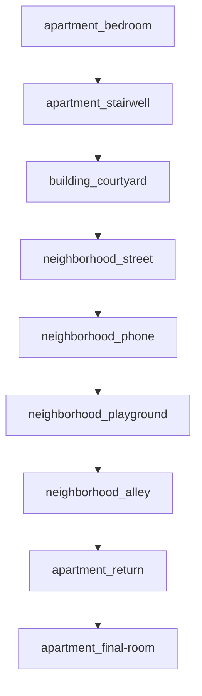

# 3:07

9 locations; 8 routes; 0 errors; 3 warnings.

| Location | Role | Story |
|---|---|---|
| apartment.bedroom | cold-open | wake-at-307 |
| apartment.stairwell | descent | door-click, first-glimpse |
| building.courtyard | pursuit | lost-rabbit |
| neighborhood.street | pursuit | one-corner-ahead |
| neighborhood.phone | voice-clue | payphone-message |
| neighborhood.playground | dread-peak | empty-swing |
| neighborhood.alley | blackout | dont-turn-around |
| apartment.return | reversal | son-is-home |
| apartment.final-room | ending | something-followed |

